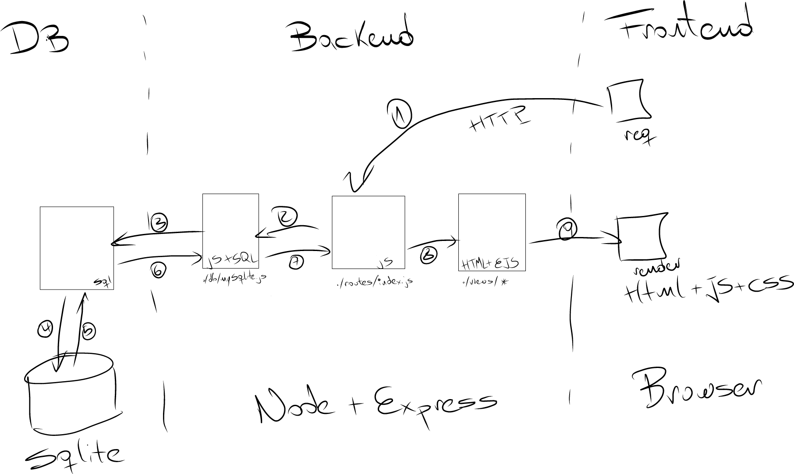

# ProjectFlora_NodeExpressEJSSqlite
Includes basic flower business application for expense tracking using Node+Express+EJS+BootStrap+Sqlite

# Scope for development
The application design involves allowing customer to place orders which is currently not implemented.
## Using it

1) Clone the repo
2) Install the dependencies

```
npm install
```


3) Start the server

```
npm start
```

4) Point your browser to http://locahost:3000


## Architecture


